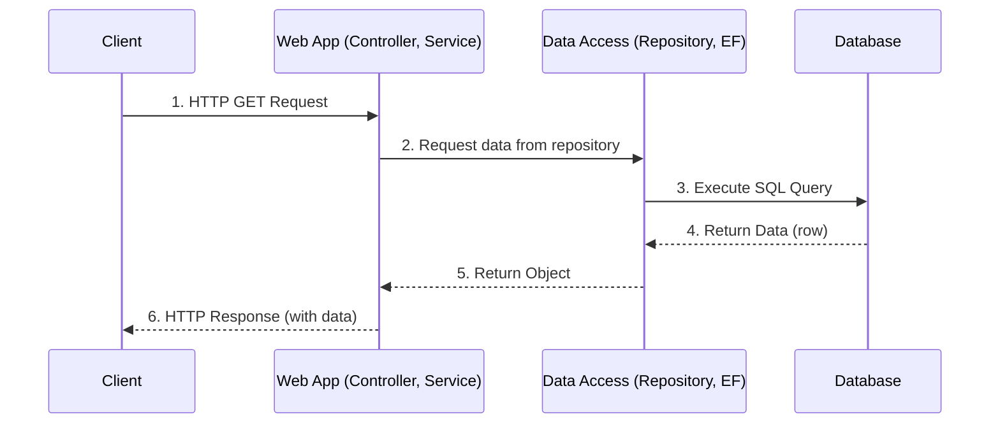

```mermaid
sequenceDiagram
  participant B as Client
  participant WA as Web App (Controller, Service)
  participant DA as Data Access (Repository, EF)
  participant D as Database

  B->>WA: 1. HTTP GET Request
  WA->>DA: 2. Request data from repository
  DA->>D: 3. Execute SQL Query
  D-->>DA: 4. Return Data (row)
  DA-->>WA: 5. Return Object
  WA-->>B: 6. HTTP Response (with data)
```