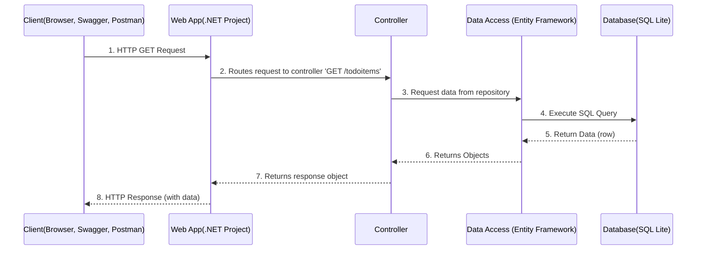

```mermaid
sequenceDiagram
  participant B as Client(Browser, Swagger, Postman)
  participant WA as Web App(.NET Project)
  participant Controller
  participant DA as Data Access (Entity Framework)
  participant D as Database(SQL Lite)

  B->>WA: 1. HTTP GET Request
  WA ->> Controller :2. Routes request to controller 'GET /todoitems'
  Controller->>DA: 3. Request data from repository
  DA->>D: 4. Execute SQL Query
  D-->>DA: 5. Return Data (row)
  DA-->>Controller: 6. Returns Objects
  Controller-->>WA: 7. Returns response object
  WA-->>B: 8. HTTP Response (with data)
```
